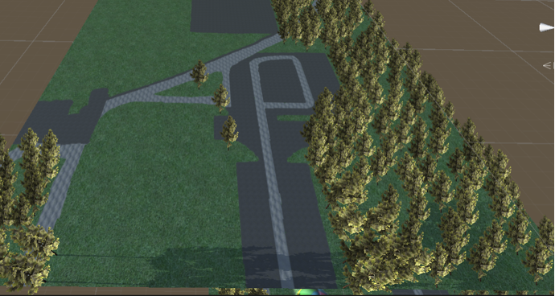
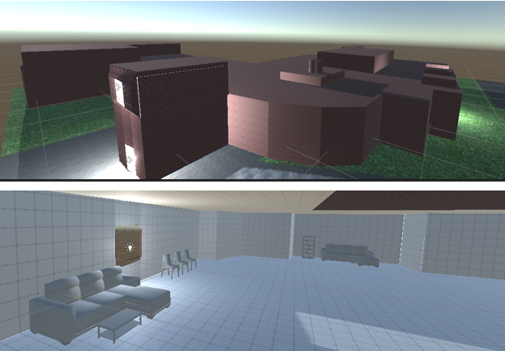
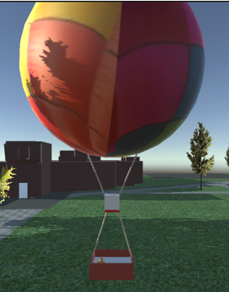
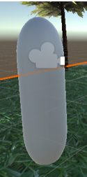
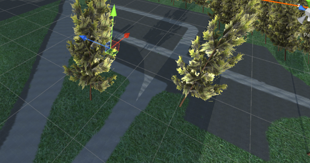
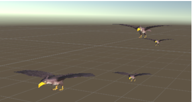
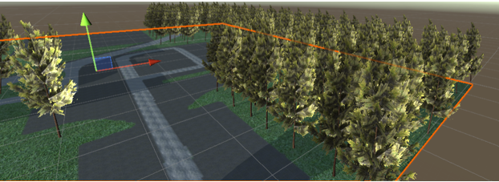
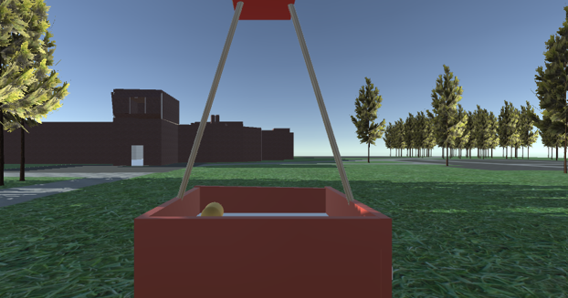
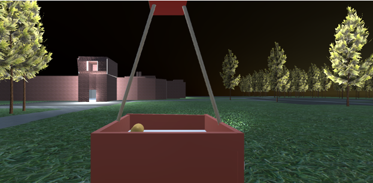
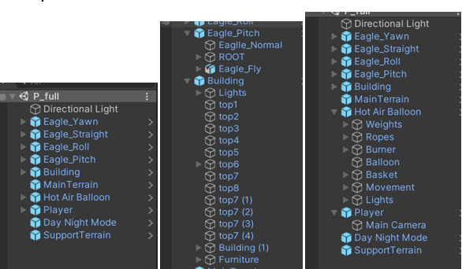

# Virtual Reality
## Assignment 1

**Name:** Prateek Sengar  

[Project Download Link](https://drive.google.com/file/d/1262FwNOJXXOD_Wr1MCJgQlHuaoP1fS_o/view?usp=drive_link) 
---

The task was to build a subsection of Stony Brook University and provide the functionality to tour around using a hot air balloon. I was able to complete the task, and the following is an in-depth explanation of all my implementations.

**Chosen Subsection:** P (Heavy Engineering)  
**Unity Version:** 2020.3.25

## 1. Terrain
The P subsection’s terrain was mostly grass, roads, and parking lot. I calculated the terrain width and length using the co-ordinates that were provided with the assignment. My main terrain was 160m x 160m. I had to make two terrains as I had to support a part of my building that was out of the main terrain. The support terrain was 50m x 50m. I used Google Earth Pro for getting the positioning of the roads, trees, and parking lot. The concrete texture was used for painting the road, pebbled texture for the parking lots and grass for the rest. I did create the mask map for extra detail.

- **Main Terrain:** This is the terrain that contains most of the implementation. The terrain had a lot of trees as the heavy engineering building is surrounded by them. I made it as close to Google Earth Pro’s estimations.

- **Support Terrain:** This terrain was just painted with grass layer so that my buildings have support.

## 2. Building
I constructed the heavy engineering building. I managed to get the shape of the building as close to the original as possible. It was a big building but it was fun to construct. I took into consideration the top of the building as well, constructing the elevations as close to real as possible. I used the Google Earth Pro’s co-ordinate system to get the height of the building as perfect as possible (by keeping the cursor at the ground and then at the top to measure the difference). The building also has a total of four windows. I also did some internet searches to check if the dimensions add up. Apart from this I added some furniture inside the building like sofas, chairs, bookshelves.

## 3. Hot Air Balloon
I constructed the hot air balloon from scratch. It has a basket, balloon, ropes, burner, lights, and weights. The basket is brown but turns green slowly if looked at for 5 seconds (indicating the player that they are going to get in the basket). Then there is a burner that turns green which makes the balloon and the player ascend. After that the balloon moves in the direction where the player is looking slowly. At night the lights on top of the player and a spot light at the bottom turns on. Also, when looked at the weight bags, they turn green and the balloon slowly descends and the player gets out.

## 4. Player
For the player, I used a capsule game object and attached the main camera to it. The height of capsule is 1.8 meters (average height of human). The camera is attached at eye level of that game object.

## 5. Paths
I tried constructing the paths as close to the Google Earth’s visualizations as possible. I used all the required textures and created roads and parking lots.

## 6. Bird
I used an eagle asset from the store for the bird. The bird is animated. I made a total of four birds and they are as follows:
- **Straight bird:** Travels in a straight direction and follows a sin function for the altitude.
- **Roll bird:** Implements the roll rotation.
- **Yaw bird:** Implements the yaw rotation.
- **Pitch bird:** Implements the pitch rotation.

## 7. Vegetation
As the P subsection was filled with trees, I didn’t hesitate to put them in. I tried using a high-definition tree asset for it but the game lagged so I went for a lower graphic tree but it came out great as I was able to do justice to the areas that had dense trees.

## 8. Day and Night Mode
I was able to implement the day and night mode (both lasting around a minute). The sun rises from the east and sets in the west (this might not be evident as I am facing south when I start so it's reversed). Also, the lights in the building and the hot air balloon turn on and off as per the day or night.

## 9. User Modes
As explained earlier all the required functionalities were implemented like getting on and off the hot air balloon, ascending and descending, moving in the direction of view.

## Hierarchy

It was really a fun experience creating my first-ever VR implementation. It faced some setbacks during say installing the plugin, weird performing scripts and so on but in the end, I am more than satisfied with what I created. I would also like to thank the TA’s who answered each query with such detail. Also, I am grateful to Prof. Kaufman for teaching the basics required for the assignment.

## References
1. [Teleportation: Code Used](https://www.youtube.com/watch?v=mrYkd1U7RZE&ab_channel=NimaJamalian)
2. **Materials**
   - [Grass Material](https://freepbr.com/materials/grass-1-pbr-material/)
   - [Road Material](https://freepbr.com/materials/pebbled-asphalt1/)
   - [Sidewalk Material](https://freepbr.com/materials/concrete-3-pbr-material/)
   - [Brick Material](https://freepbr.com/materials/rounded-brick-1/)
   - [Dirt Path Material](https://freepbr.com/materials/dirt-with-rocks/)
3. [Channel Mixer/Packer](https://assetstore.unity.com/packages/tools/utilities/channel-mixer-packer-133787)
4. [Egypt Pack – Eagle](https://assetstore.unity.com/packages/3d/characters/animals/birds/egypt-pack-eagle-140079)
5. [Mobile Tree Package](https://assetstore.unity.com/packages/3d/vegetation/trees/mobile-tree-package-18866)
6. [Day Night Mode](https://www3.cs.stonybrook.edu/~cse566/DayNightMode.unitypackage)
7. [Toon Furniture](https://assetstore.unity.com/packages/3d/props/furniture/toon-furniture-88740)
8. [Measuring Tool](https://assetstore.unity.com/packages/tools/utilities/measuring-tool-226340)
9. Google Cardboard XR Plugin for Unity [Sample Scripts]
10. Pro Builder Tool

---
